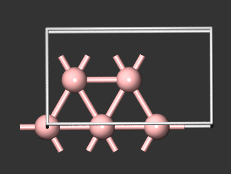
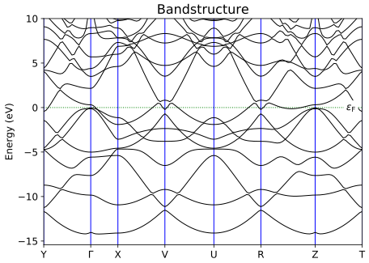
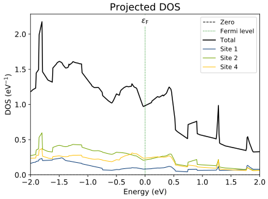
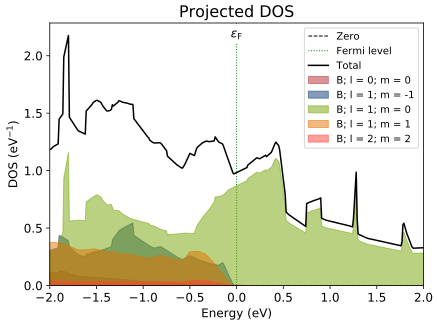
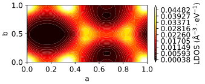
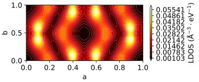
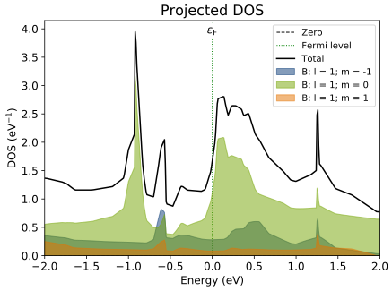
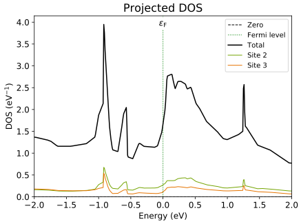

# Borophene	

## Borophene phases

$\chi_3$ and $\beta_12$ structures of boropphene

Thsese structural has metalic character and nonmagnetic

### $\chi_3$ vs $\beta_12$ 

#### 

- which one has more metalic character? why?
- Atom types for B12 (B6c, B5c, B4c)  and for X3 (B5c and B4c)
- Projected DOS shows that lower coordinated atoms has more contribution in structure conductance and less tendency to bind other atom (compare dos projected over different types)

#### B12

In the case of B12 we have B1|B2|B3 atoms as is shown in 

**DOS/LDOS**

From above fig one can see that B1 and B2 have dominant contribution near the Fermi energy while B3 has no significant contribution in this regoin, This can also be seen from LDOS plot which shows regoins with denser states near the fermi surface as bright and regoin with lower number of states in dark

**PDOS**

projected dos shows larger contribution of Pz orbitals

## X3

- X3 has two types of atom named B1, B2
- B1 has more contribution in fermi states (bright regoin in ldos plot)
- despite B12 structure px and py orbitals play a significant role in fermi level DOS which indicates totally different type of hybridation for these materials 

## Transition metal adatom on 2D borophene

## B12_Fe

- Fe 3d6 electron exchange with semifilled Pz orbitals of six neighbor boron atoms

Adsorption of adatoms and gases can affect their properties drastically

Fe/X3   =====    average bonding length 1.93

## X3_Fe

